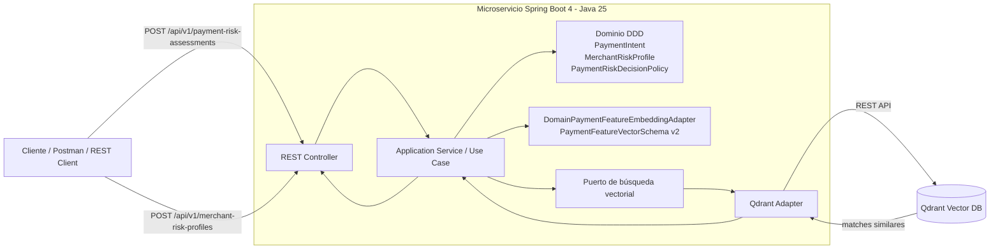

# PoC Payment Similarity Search con Java 25, Spring Boot 4 y Qdrant

# Descripción de la funcionalidad

Esta PoC implementa un microservicio REST enfocado en pagos. El caso busca **evaluar el riesgo de una transacción nueva comparándola por 
similitud contra perfiles históricos de comercios y patrones de pago** almacenados en Qdrant.

La PoC no entrena modelos de IA. Usa un vectorizador de dominio llamado **DomainPaymentFeatureEmbeddingAdapter**, 
que transforma datos estructurados de pagos en un vector explícito, versionado y normalizado:

1. Se precargan perfiles de riesgo de comercios en Qdrant.
2. Cada perfil se convierte en un vector numérico de 32 dimensiones con schema `payment-risk-vector-v2`.
3. Una transacción nueva se convierte en un vector con la misma semántica de negocio.
4. Qdrant busca los perfiles más similares por distancia coseno.
5. Una política de dominio decide si la transacción debe aprobarse, revisarse o rechazarse.


# Componentes de infraestructura

La infraestructura mínima es:

| Componente | Uso |
|---|---|
| Qdrant | Base vectorial para almacenar perfiles de riesgo y ejecutar similarity search. |

# Tecnologias

- JDK 25
- Maven 3.9.x o superior
- Docker / Docker Compose
# Estructura del proyecto

```text
payment-similarity-poc/
├── pom.xml
├── README.md
├── src/
│   ├── main/
│   │   ├── java/com/edgarrt/poc/paymentsimilarity/
│   │   │   ├── PaymentSimilarityApplication.java
│   │   │   ├── application/
│   │   │   │   ├── port/in/              # Casos de uso de entrada
│   │   │   │   ├── port/out/             # Puertos hacia infraestructura
│   │   │   │   └── service/              # Orquestación de casos de uso
│   │   │   ├── domain/
│   │   │   │   ├── exception/            # Excepciones de dominio
│   │   │   │   ├── model/                # Agregados, entidades y value objects
│   │   │   │   └── service/              # Servicios de dominio
│   │   │   └── infrastructure/
│   │   │       ├── adapter/in/rest/       # Controladores REST y DTOs
│   │   │       ├── adapter/out/qdrant/    # Adaptador de salida hacia Qdrant
│   │   │       ├── config/                # Beans y properties
│   │   │       └── exception/             # Manejo global de errores
│   │   └── resources/application.yml
│   └── test/java/...                      # Tests unitarios de dominio
└── infrastructure/
    ├── docker-compose.yml                 # Qdrant local
    ├── Dockerfile                         # Imagen opcional del microservicio
    ├── requests/payment-similarity.http   # Requests HTTP de prueba
    └── datasets/
        ├── merchant-risk-profiles.json    # Dataset de perfiles
        ├── seed_profiles.py               # Script de precarga usando la API del microservicio
        └── README.md                      # Instrucciones del dataset
```

# Diagrama de arquitectura




# Código principal

## Domain

Contiene el lenguaje ubicuo del caso de pagos:

- `PaymentIntent`: representa el pago que se quiere evaluar.
- `MerchantRiskProfile`: representa un patrón histórico indexable en Qdrant.
- `PaymentAssessment`: resultado de evaluación de riesgo.
- `SimilarityMatch`: coincidencia encontrada por Qdrant.
- `PaymentRiskDecisionPolicy`: política de dominio que decide `APPROVE`, `REVIEW` o `DECLINE`.

## Application

Orquesta casos de uso:

- `AssessPaymentRiskService`: convierte el pago a vector, consulta Qdrant y aplica la política de dominio.
- `IndexMerchantRiskProfileService`: convierte perfiles históricos a vectores y los almacena en Qdrant.

## Infrastructure

Implementa detalles técnicos:

- `PaymentRiskAssessmentController`: API REST.
- `MerchantRiskProfileController`: API REST para indexar perfiles.
- `DomainPaymentFeatureEmbeddingAdapter`: vectorizador de dominio de 32 dimensiones con features explícitas para pagos.
- `PaymentFeatureVectorSchema`: contrato versionado del vector `payment-risk-vector-v2`.
- `QdrantMerchantRiskProfileRepository`: adaptador HTTP hacia Qdrant.


# Vectorización aplicada

Usa un vectorizador elaborado para el caso de pagos:

| Grupo de features | Ejemplos | Motivo |
|---|---|---|
| Monto | log-normalización y buckets micro/bajo/medio/alto | Evita que montos grandes dominen toda la distancia. |
| Método de pago | CARD, WALLET, TRANSFER, QR | Distingue patrones de riesgo por rail de pago. |
| Canal | POS, ECOMMERCE, MOBILE, API | Diferencia fraude presencial, online, móvil e integración API. |
| País | PE, LATAM, OTHER | Permite separar patrones locales y cross-border. |
| MCC agrupado | food/grocery, pharmacy, electronics, travel, transport, digital goods | Reduce ruido del código exacto y conserva semántica comercial. |
| Señales de riesgo | tarjeta internacional, dispositivo nuevo, contracargos previos | Acerca pagos nuevos a perfiles con presión de riesgo similar. |
| Presión histórica | chargeback/fraud rate en bps | Usa comportamiento histórico del comercio como señal cuantitativa. |
| Priors de acción | APPROVE, REVIEW, DECLINE | Ayuda a alinear la similitud con la decisión histórica esperada. |

# Cómo levantar Qdrant

Desde la raíz del proyecto:

```bash
docker compose -f infrastructure/docker-compose.yml up -d
```

Validar Qdrant:

```bash
curl http://localhost:6333/collections
```

# Cómo ejecutar el proyecto localmente

Compilar:

```bash
mvn clean verify
```

Ejecutar:

```bash
mvn spring-boot:run
```

Health check:

```bash
curl http://localhost:8080/actuator/health
```

# Cómo precargar el dataset

Con Qdrant y el microservicio levantados:

```bash
python3 infrastructure/datasets/seed_profiles.py
```

# Cómo probar el caso de uso

Opción 1: usar el archivo HTTP:

```text
infrastructure/requests/payment-similarity.http
```

Opción 2: usar curl:

## 1. Indexar perfil de riesgo

```http
POST /api/v1/merchant-risk-profiles
Content-Type: application/json

{
  "profileCode": "MRC-HIGH-RISK-001",
  "merchantName": "Betamarket Digital",
  "mcc": "5734",
  "country": "PE",
  "paymentMethod": "CARD",
  "avgAmount": 280.00,
  "chargebackRateBps": 380,
  "fraudRateBps": 210,
  "recommendedAction": "REVIEW",
  "label": "digital goods with high chargeback pattern",
  "notes": "Ticket medio alto y contracargos recurrentes."
}
```

## 2. Evaluar un pago con similarity search

```http
POST /api/v1/payment-risk-assessments
Content-Type: application/json

{
  "paymentId": "018f4df9-7d26-7c0f-9bb5-70077d4ef001",
  "amount": 295.90,
  "currency": "PEN",
  "merchantId": "merchant-991",
  "merchantName": "Beta Market Online",
  "mcc": "5734",
  "country": "PE",
  "paymentMethod": "CARD",
  "channel": "ECOMMERCE",
  "internationalCard": false,
  "newDevice": true,
  "previousChargebacks": 1,
  "topK": 3
}
```

Respuesta esperada:

```json
{
  "assessmentId": "...",
  "paymentId": "018f4df9-7d26-7c0f-9bb5-70077d4ef001",
  "action": "REVIEW",
  "confidence": 0.93,
  "reason": "Perfil similar de riesgo medio/alto encontrado en Qdrant.",
  "matches": [
    {
      "profileCode": "MRC-HIGH-RISK-001",
      "score": 0.93,
      "recommendedAction": "REVIEW",
      "label": "digital goods with high chargeback pattern"
    }
  ]
}
```

# Dataset de perfiles de riesgo para Payment Similarity Search

# Contenido

Esta carpeta contiene datos de prueba para precargar perfiles de riesgo de comercios en la PoC.

| Archivo | Descripción |
|---|---|
| `merchant-risk-profiles.json` | Perfiles históricos de comercios y patrones de pago. |
| `seed_profiles.py` | Script Python que invoca la API del microservicio para indexar perfiles en Qdrant. |

# Validar datos en Qdrant

```bash
curl http://localhost:6333/collections/merchant_risk_profiles
```

Para inspeccionar puntos:

```bash
curl -X POST http://localhost:6333/collections/merchant_risk_profiles/points/scroll \
  -H 'Content-Type: application/json' \
  -d '{"limit": 5, "with_payload": true, "with_vector": false}'
```

# Payment risk vector schema

Este schema transforma pagos y perfiles históricos de comercios en un vector de 32 dimensiones para ejecutar similarity search en 
Qdrant usando distancia coseno.

El diseño usa dimensiones explícitas. Esto permite explicar por qué dos pagos son similares, 
versionar cambios del vector y migrar colecciones en Qdrant cuando el contrato cambia.

# Dimensiones

| Índice | Dimensión | Tipo | Descripción |
|---:|---|---|---|
| 0 | amount_log_norm | Numérica | Monto con log-normalización y cap de 20,000. |
| 1 | amount_micro | Bucket | Monto <= 10. |
| 2 | amount_low | Bucket | Monto > 10 y <= 100. |
| 3 | amount_medium | Bucket | Monto > 100 y <= 1,000. |
| 4 | amount_high | Bucket | Monto > 1,000. |
| 5 | card_local | Señal | Pago con tarjeta no internacional. |
| 6 | card_international | Señal | Pago con tarjeta internacional. |
| 7 | new_device | Señal | Pago desde dispositivo nuevo. |
| 8 | previous_chargebacks | Numérica | Contracargos previos normalizados con cap de 5. |
| 9 | historical_chargeback_pressure | Numérica | Presión de contracargos históricos o proxy del pago actual. |
| 10 | historical_fraud_pressure | Numérica | Presión de fraude histórico o proxy del pago actual. |
| 11 | method_card | Categórica | Método de pago CARD. |
| 12 | method_wallet | Categórica | Método de pago WALLET. |
| 13 | method_transfer | Categórica | Método de pago TRANSFER. |
| 14 | method_qr | Categórica | Método de pago QR. |
| 15 | channel_pos | Categórica | Canal POS / físico. |
| 16 | channel_ecommerce | Categórica | Canal ecommerce / online. |
| 17 | channel_mobile | Categórica | Canal móvil / app / wallet. |
| 18 | channel_api | Categórica | Canal API / open banking / pago inmediato. |
| 19 | country_pe | Categórica | Operación en Perú. |
| 20 | country_latam | Categórica | Operación en país LATAM distinto de Perú. |
| 21 | country_other | Categórica | Operación fuera de LATAM. |
| 22 | mcc_food_grocery | Categórica | Comida, restaurante o grocery. |
| 23 | mcc_pharmacy_health | Categórica | Farmacia o salud. |
| 24 | mcc_retail_electronics | Categórica | Retail o electrónica. |
| 25 | mcc_travel_ticketing | Categórica | Viajes, hoteles, tickets o eventos. |
| 26 | mcc_transport | Categórica | Transporte. |
| 27 | mcc_digital_goods | Categórica | Bienes digitales o servicios digitales. |
| 28 | risk_intensity | Numérica | Intensidad de riesgo consolidada. |
| 29 | action_approve_prior | Prior | Perfil o pago orientado a aprobación. |
| 30 | action_review_prior | Prior | Perfil o pago orientado a revisión. |
| 31 | action_decline_prior | Prior | Perfil o pago orientado a rechazo. |

# Notas 

- Qdrant se usa como base vectorial y almacenamiento de payload de perfiles.
- Todos los vectores se normalizan con L2 antes de enviarse a Qdrant.
- La PoC usa distancia `Cosine`.
- La colección se crea automáticamente al primer upsert o search si no existe.
- En producción, este vectorizador puede evolucionar a una feature-store real, incorporar embeddings de texto para nombre/descriptor del comercio, o llamar a un servicio de scoring/ML externo manteniendo el mismo puerto `PaymentEmbeddingPort`.
