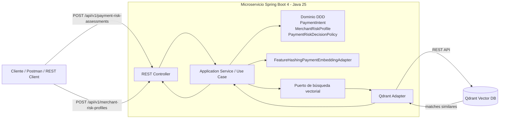

# PoC Payment Similarity Search con Java 25, Spring Boot 4 y Qdrant

# Descripción de la funcionalidad

Esta PoC implementa un microservicio REST enfocada en pagos. El caso es de **evaluar el riesgo de una transacción nueva comparándola por similitud 
contra perfiles históricos de comercios y patrones de pago** almacenados en Qdrant.

La PoC no entrena modelos de IA. Usa una estrategia simple de vectorización determinística llamada **feature hashing**, suficiente para demostrar el patrón 
técnico de similarity search:

1. Se precargan perfiles de riesgo de comercios en Qdrant.
2. Cada perfil se convierte en un vector numérico de 16 dimensiones.
3. Una transacción nueva se convierte en un vector con la misma función.
4. Qdrant busca los perfiles más similares por distancia coseno.
5. Una política de dominio decide si la transacción debe aprobarse, revisarse o rechazarse.

# Componentes de infraestructura

La infraestructura mínima es:

| Componente | Uso |
|---|---|
| Qdrant | Base vectorial para almacenar perfiles de riesgo y ejecutar similarity search. |


# Estructura del proyecto

```text
payment-similarity-poc/
├── pom.xml
├── README.md
├── src/
│   ├── main/
│   │   ├── java/com/edgarrt/poc/paymentsimilarity/
│   │   │   ├── PaymentSimilarityApplication.java
│   │   │   ├── application/
│   │   │   │   ├── port/in/              # Casos de uso de entrada
│   │   │   │   ├── port/out/             # Puertos hacia infraestructura
│   │   │   │   └── service/              # Orquestación de casos de uso
│   │   │   ├── domain/
│   │   │   │   ├── exception/            # Excepciones de dominio
│   │   │   │   ├── model/                # Agregados, entidades y value objects
│   │   │   │   └── service/              # Servicios de dominio
│   │   │   └── infrastructure/
│   │   │       ├── adapter/in/rest/       # Controladores REST y DTOs
│   │   │       ├── adapter/out/qdrant/    # Adaptador de salida hacia Qdrant
│   │   │       ├── config/                # Beans y properties
│   │   │       └── exception/             # Manejo global de errores
│   │   └── resources/application.yml
│   └── test/java/...                      # Tests unitarios de dominio
└── infrastructure/
    ├── docker-compose.yml                 # Qdrant local
    ├── Dockerfile                         # Imagen opcional del microservicio
    ├── requests/payment-similarity.http   # Requests HTTP de prueba
    └── datasets/
        ├── merchant-risk-profiles.json    # Dataset de perfiles
        ├── seed_profiles.py               # Script de precarga usando la API del microservicio
        └── README.md                      # Instrucciones del dataset
```

# Diagrama de arquitectura



# API REST

## 1. Indexar perfil de riesgo

```http
POST /api/v1/merchant-risk-profiles
Content-Type: application/json

{
  "profileCode": "MRC-HIGH-RISK-001",
  "merchantName": "Betamarket Digital",
  "mcc": "5734",
  "country": "PE",
  "paymentMethod": "CARD",
  "avgAmount": 280.00,
  "chargebackRateBps": 380,
  "fraudRateBps": 210,
  "recommendedAction": "REVIEW",
  "label": "digital goods with high chargeback pattern",
  "notes": "Ticket medio alto y contracargos recurrentes."
}
```

## 2. Evaluar un pago con similarity search

```http
POST /api/v1/payment-risk-assessments
Content-Type: application/json

{
  "paymentId": "018f4df9-7d26-7c0f-9bb5-70077d4ef001",
  "amount": 295.90,
  "currency": "PEN",
  "merchantId": "merchant-991",
  "merchantName": "Beta Market Online",
  "mcc": "5734",
  "country": "PE",
  "paymentMethod": "CARD",
  "channel": "ECOMMERCE",
  "internationalCard": false,
  "newDevice": true,
  "previousChargebacks": 1,
  "topK": 3
}
```

Respuesta esperada:

```json
{
  "assessmentId": "...",
  "paymentId": "018f4df9-7d26-7c0f-9bb5-70077d4ef001",
  "action": "REVIEW",
  "confidence": 0.93,
  "reason": "Perfil similar de riesgo medio/alto encontrado en Qdrant.",
  "matches": [
    {
      "profileCode": "MRC-HIGH-RISK-001",
      "score": 0.93,
      "recommendedAction": "REVIEW",
      "label": "digital goods with high chargeback pattern"
    }
  ]
}
```

# Código principal

## Domain

Contiene el lenguaje ubicuo del caso de pagos:

- `PaymentIntent`: representa el pago que se quiere evaluar.
- `MerchantRiskProfile`: representa un patrón histórico indexable en Qdrant.
- `PaymentAssessment`: resultado de evaluación de riesgo.
- `SimilarityMatch`: coincidencia encontrada por Qdrant.
- `PaymentRiskDecisionPolicy`: política de dominio que decide `APPROVE`, `REVIEW` o `DECLINE`.

## Application

Orquesta casos de uso:

- `AssessPaymentRiskService`: convierte el pago a vector, consulta Qdrant y aplica la política de dominio.
- `IndexMerchantRiskProfileService`: convierte perfiles históricos a vectores y los almacena en Qdrant.

## Infrastructure

Implementa detalles técnicos:

- `PaymentRiskAssessmentController`: API REST.
- `MerchantRiskProfileController`: API REST para indexar perfiles.
- `FeatureHashingPaymentEmbeddingAdapter`: vectorizador determinístico de 16 dimensiones.
- `QdrantMerchantRiskProfileRepository`: adaptador HTTP hacia Qdrant.

# Cómo levantar Qdrant

Desde la raíz del proyecto:

```bash
docker compose -f infrastructure/docker-compose.yml up -d
```

Validar Qdrant:

```bash
curl http://localhost:6333/collections
```

# Cómo ejecutar el proyecto localmente

Requisitos:

- JDK 25
- Maven 3.9.x o superior
- Docker / Docker Compose

Compilar:

```bash
mvn clean verify
```

Ejecutar:

```bash
mvn spring-boot:run
```

Health check:

```bash
curl http://localhost:8080/actuator/health
```

# Cómo precargar el dataset

Con Qdrant y el microservicio levantados:

```bash
python3 infrastructure/datasets/seed_profiles.py
```

También puedes revisar las instrucciones completas en:

```text
infrastructure/datasets/README.md
```

# Cómo probar el caso de uso

Opción 1: usar el archivo HTTP:

```text
infrastructure/requests/payment-similarity.http
```

Opción 2: usar curl:

```bash
curl -X POST http://localhost:8080/api/v1/payment-risk-assessments \
  -H 'Content-Type: application/json' \
  -d '{
    "paymentId": "018f4df9-7d26-7c0f-9bb5-70077d4ef001",
    "amount": 295.90,
    "currency": "PEN",
    "merchantId": "merchant-991",
    "merchantName": "Beta Market Online",
    "mcc": "5734",
    "country": "PE",
    "paymentMethod": "CARD",
    "channel": "ECOMMERCE",
    "internationalCard": false,
    "newDevice": true,
    "previousChargebacks": 1,
    "topK": 3
  }'
```

# Ejecución con Docker del microservicio

La imagen del microservicio es opcional. Para compilar y correr el servicio en Docker:

```bash
docker build -f infrastructure/Dockerfile -t payment-similarity-poc:local .
docker run --rm -p 8080:8080 \
  -e APP_QDRANT_URL=http://host.docker.internal:6333 \
  payment-similarity-poc:local
```

En Linux, si `host.docker.internal` no resuelve, usa la IP del host o agrega `--add-host=host.docker.internal:host-gateway`.

# Notas de diseño

- Qdrant se usa como base vectorial y almacenamiento de payload de perfiles.
- La PoC usa distancia `Cosine`.
- La colección se crea automáticamente al primer upsert o search si no existe.
- El vectorizador es intencionalmente simple para que la PoC sea autocontenida.
- En producción se reemplazaría `FeatureHashingPaymentEmbeddingAdapter` por embeddings generados por un modelo, reglas feature-store o un servicio especializado.
